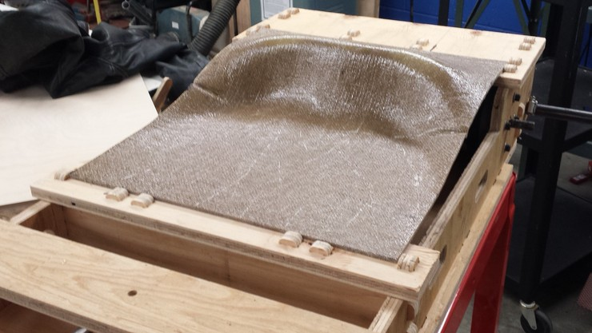

For the composites assignment, I decided to try making a seat for the
go-kart in my final project. The seat covers an area of approximately
15" by 18", and composites are the only material that can span this
size, conform to an arbitrary shape, be lightweight, and strong enough
to hold a person.

## Design

I designed the seat in SolidWorks using the chassis of my go-kart as a
guide. The bottom surface of the seat is defined using a set of
splines that are mirrored across the center of the chassis. These
splines are then selected to create a lofted surface:

An improved surface could be obtained by using more splines, and
accurately modeling the shape of someone's behind. This model was
drawn somewhat arbitrarily, with the only real constraint being
symmetry.

After the initial surface was drawn, I used SolidWorks' **Thicken
Surface** tool to create the seat feature. We can also set the material
to burlap, which paints a texture on the feature and gives us a
general idea of what it might look like when created:

I plan to create a one-sided mold using the top surface of the
seat. To do this, I need to cut out a mold that is larger than the
seat itself, so that there is room to create a slightly bigger seat
than necessary that can be trimmed using the band saw to get crisp
edges. I found that a good way to do this is to use the **Extend
Surface** tool's **linear** mode to extrapolate the surface on all
sides. Here's the result, with the seat exported to a separate part
file:

## Mold Lamination

Because the seat is relatively deep, I had to laminate together a
couple of layers of foam to cut it out on the ShopBot. From others'
experiences, gluing together layers of foam can be tricky, because
it's hard to evenly clamp two large pieces together.

Dan Rosenberg came to the rescue with his vacuum bag technique, which
uses the same tools as later in the process. By gluing the foam
together using Gorilla Glue (polyurethane) and then vacuum bagging it,
we use atmospheric pressure to clamp the two pieces together.  We're
using the large clothing bag here, and it's important to have a clean
and protected surface while doing this to avoid any accidental
perforations to the bag. Spreading some paper over the work surface is
a good idea.

To glue two pieces together, apply Gorilla Glue evenly to one side,
and distilled water to the other---water catalyzes the curing of
polyurethane glue. Then put them together into the vacuum bag. The
pieces may slide slightly as vacuum is applied, so it's advisable to
help them align as necessary..

Here's what the laminated layers look like with vacuum applied. The
blocks of foam aren't attached to anything, but they don't have to
be---there aren't any forces that would cause them to warp.

After lamination, we can just glue the two pieces to an appropriately
sized piece of OSB with hot glue. This is significantly easier than
the Gorilla Glue needed for the foam layers.

## Mold Machining

Here's the mold on the ShopBot, ready to be cut. Because the surface
finish of composite molds isn't very important, I'm using the 1/2" end
mill with a move rate of 10 inches/sec for maximum speed.

Here you can see that I've zeroed the machine right in the center of
the foam block. This is because I measured a block of foam slightly
smaller than the extended mesh that I'll be cutting, and by telling
the machine that the material is slightly larger than it actually is,
I'll get the entire surface cut right to the edge. This allows the
composite to extend past the design boundary to be trimmed later.

Here's the roughing toolpath generated by PartWorks3D. You can see
that the tool is enclosed within a boundary, but as this is slightly
bigger than the foam block, it will cut all the way to the edge (and
slightly over). Parameters on this toolpath were 1/2" end mill at
12000 RPM, move speed 10 inches/sec, and 50% stepover. These are
relatively fast parameters and help to reduce cutting time
significantly---surface is less important for composite molds.

When cutting at these move speeds, make sure the accleration
parameters on the machine are set to sane values, or there will be
some very jerky movements.

Here's the roughing toolpath after cutting---it's a nice contour plot!

This is the finishing toolpath, cut at a 45 degree angle.

Here's the machining in progress with the finishing toolpath, which
was also at 10 inches/sec, but with 25% stepover. One curious thing to
note is that the steep slopes that the machine travels over actually
consist of hundreds of different points in the `.sbp`
file. Occasionally, these resulted in some jerky movements, and Dan
and I hypothesized that this might be due to low resolution of the
points relative to the move speed, resulting in the stepper motors on
some axes starting and stopping instead of moving smoothly.

After another finishing pass perpendicular to the first, the mold is
ready for use. Overall, the roughing cut took about 15 minutes, and
each finishing cut took another 20 minutes. Overall, not bad given the
size of the part. Here's the finished mold, ready for the next step:

## Composite Layup

I got all the materials ready for the composite before getting out the
epoxy. Here are all the layers for a one-sided mold, from top to
bottom:

- Breather (polyester batting)
- Bleeder (plastic sheet with holes)
- *mold release sprayed on bleeder*
- 5 layers of epoxy-impregnated burlap
- *mold release sprayed on peel layer*
- Peel layer (saran wrap or similar material)
- Burlap insulation layer (prevents exothermic epoxide reaction from affecting foam)
- One-sided mold
- **Burlap protection layer**

The final layer of burlap, all the way on the bottom of the mold,
helps to **prevent sharp edges or splinters on the OSB from puncturing
the vacuum bag**. I noticed that many bags made by my peers were
leaking, so hopefully this would help the situation and not require
vacuum to be pulled continuously while the epoxy was setting.

The next step is to work quickly to get all of the middle layers
impregnated with epoxy and the entire setup into the vacuum bag. For a
5-layer composite over an area of about 16" x 20", I needed 20 pumps
of epoxy resin and 10 pumps of hardener, mixed in two separate
cups. That was a lot of epoxy, and is somewhat stressful to work with
under time pressure. It may also have been too much, as a lot of epoxy
has soaked into the breather after pulling vacuum.

Although I tried very hard to position the composite layers in the
center of the mold, they inevitably moved with the atmospheric
pressure after inducing the vacuum. For this reason, I don't think
it's realistic to try and get a perfect shape directly from the mold;
it seems much more reasonable to trim it afterward.

Note that I've positioned the vacuum valve right at the corner of the
mold, where any impression it makes will be cut off from the final
part.

It seems that the vacuum precautions worked; after almost 8 hours, the
entire mold still looks as good as it did when I started---with no
inflated areas. These clothing bags seal very well when used as
directed.

Since I had sprayed a liberal amount of mold release on both sides of
the part, demolding was pretty easy, and everything just peeled right
off with very little fuss.

Here's the finished seat next to the mold, which is still in good
shape and could be used again. Although the cure time for the "high
bio content" epoxy is nominally 4 hours, the mold is still a little
pliable 8 hours after casting, but should continue to harden over the
next day or so.

Here's the seat, positioned approximately where it is meant to fit on
the go-kart chassis. As intended, it's slightly bigger on all sides,
and will need to be trimmed down to the final size for use.

I used the chassis of the go-kart as a reference to mark the
appropriate cuts on the seat. The band saw makes quick work of this,
leaving us with a seat that fits perfectly into the designed area.

