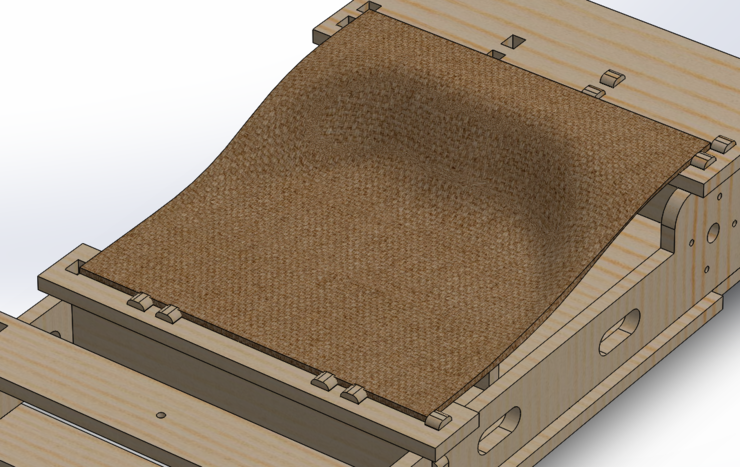

What's this project all about? Basically, to get this picture of Neil
racing Luigi:

It's a pretty fast electric go-kart, with a chassis made entirely of
press-fit parts and composites. Nathan Melenbrink decided to take it
for a spin at 3AM the day it was due:

<iframe width="720" height="405" src="http://www.youtube.com/embed/UJlyJaZ64OA" frameborder="0" allowfullscreen></iframe>

There are also added electronics for monitoring the battery pack
voltage. The go-kart was quite a hit at the final project
demos. Here's Neil giving it a spin!

<iframe width="720" height="405" src="http://www.youtube.com/embed/6Zrpd9Gwr50" frameborder="0" allowfullscreen></iframe>

## Conception

Over the years, I've collected various parts for making electric
vehicles, but these never materialized into anything that was very
well-designed. The goal of this project is to design a go-kart
incorporating some of them and make it sturdy and stable enough to
drive around, even at reasonably fast speeds. I'm starting with the
following parts, which have been lying unused for several years:

- 3x 12V 18Ah (half U1) lead-acid batteries
- 2x 24V 20A (continuous rating) motors, rated at 0.63 HP -- I will be
  overvolting these
- 1x Curtis 36-48V 275A golf cart motor controller

- 2x 10T #35 (0.375" pitch) roller chain sprockets
- 2x drive wheels with integrated 60T sprockets and bearings
- 2x front wheels with integrated ball bearings

If one were to buy all these parts for a new design, it would probably
cost a few hundred dollars. However, I collected them from eBay during
college for a fraction of that price, and will be designing a vehicle
around them. Apart from the above parts, I spent less than $50 from
Home Depot to buy a 4' x 8' sheet of plywood and a few bolts.

Here's a sketch from the planning phase of this project, showing the
general layout of the vehicle.

The overall design of the go-kart uses two separate motors to avoid
the need for a differential, the lack of which would create
significant wheel slip around turns. The chassis will be relatively
compact, with the power electronics tucked in the area between the
front and rear wheels and underneath the seat. The driver's legs will
extend over the front wheels, "Mario Kart" style.

My sketch also shows approximate
[Ackermann steering](http://en.wikipedia.org/wiki/Ackermann_steering_geometry),
which reduces wheel slip around turns. However, this wasn't
incorporated in to the design below due to time constraints.

## Chassis Design

I started out designing the chassis in SolidWorks using the master
modeling technique, which uses a core set of sketches in one part to
derive other parts in a top-down fashion. The initial set of sketches
comprise the width and length of the frame, as well as the power
transmission.

Using these sketches, I then add various pieces of the frame. First
are the left side panels and motor mounts. The front extension, where
the driver's feet rest, is removable to reduce the overall length of
the go-kart for easy transportation.

A few more pieces are added for the steering mechanism, and the top
and bottom panels. At this point, note that there is still nothing
specified on how the pieces are held together.

This is where the press-fit part comes in. Using what I learned from
[week 4][week4] and improving my technique, I realized that an easy
way to create press-fit geometry is to create tabs and cutouts in two
steps.

[week4]: {{site.baseurl}}

First, I use **Blocks** in SolidWorks to create a tab pattern that can
be added to many pieces in the part. This picture shows tabs being
added to the left side panel as part of an **Extruded Boss**
feature. When doing this, make sure to select specifically which
existing features to merge with.

Next, I use the left side panel itself to create an **Extruded Cut**
through all pieces that intersect with the tabs, using the two faces
of the panel to constrain the cut. This automagically creates slots
that correspond to the location of the tabs---and more importantly,
the slot positions will self-update if any of the tabs are changed!

To create the entire press-fit geometry, I've added tabs to all of the
relevant parts, then used the tabbed part to cut through the
intersecting areas. Hence, my feature list looks like a sequence of
extrusions followed by cuts:

One thing to note is that this technique can even be used to make cuts
outside of the plane of the part that is being used to make the
cut. In the above picture, the left and right sides are symmetric, so
I've used the left side to make appropriate cuts on the panels
intersecting the right side, without needing to add tabs on the right
side itself. In a production model, one might want to design all
pieces as they would be produced, but this use of symmetry saves some
time for the final project crunch.

Here's a closeup of the motor mount area. One side of the motor has
four mounting holes in a square, and is bolted to the wall of the
chassis. The other end is nestled inside a part that perfectly fits
around its diameter. This will help keep the motor straight so that
the chain drive is smooth. The inner motor part serves multiple
additional purposes, including supporting weight from the top panel,
transferring it to the rear beam using a set of tabs, and also serving
as a stop to position the batteries.

The master part contains several values for the entire model to change
parametrically. The original design actually called for two types of
plywood---thick and thin, but I opted to get just one intermediate
type and set both of these to the same value to simplify the cutting
process. Because of this parametrization, this change automatically
updated the parts after I measured the plywood I purchased, with no
manual modification needed for cutting.

## Chassis Fabrication

At this point I went to Home Depot and got a 4' x 8' sheet of
plywood. I used their saw to cut it in half, but it turns out that
**even a 4' x 4' sheet is impossible to get into a passenger car**. I
ended up cutting those in half again to obtain four 2' x 4' sheets.

After exporting the faces of each part from SolidWorks, I created
toolpaths for cutting out the slots and profiles in VCarve Pro. One
neat trick I discovered this week was the use of **layers**: by
selecting all of the outlines and sending them to a separate layer
from the holes, I could efficiently generate the two separate
toolpaths by specifying a layer instead of individual vectors. Cutting
out all the holes first is desirable as parts can move after the
outline is cut.

The entire workflow in VCarve consists of the following:

- import and arrange vectors
- join open vectors to create closed shapes
- add dog-bone fillets to all internal sharp angles for press-fit
  joints
- generate toolpath to cut out holes
- generate toolpath to cut out profiles

All the parts as designed could fit within two 2' x 4' plywood
sheets. Here's the ShopBot halfway through milling the first sheet,
with all pockets having been cut:

The first sheet, near completion, including most of the side panels
and the steering supports.

This is the second sheet, including the large bottom panel, some
horizontal beams, and the motor mounts.

## Composite Seat Design

Also in SolidWorks, I designed an organically shaped solid for the
go-kart seat to fit with all the other parts of the chassis. A much
more detailed post about constructing the seat is available from
[composites week][week8].

[week8]: {{site.baseurl}}

Here's the final product:

## Voltage Monitor

As part of the electronics on the go-kart, I designed a voltage
monitor that can be used to read the voltage of the
batteries---somewhat like a fuel gauge. The voltage will be displayed
on a 44780 LCD panel. The class doesn't have parts (i.e. a regulator)
that would make it possible to monitor the 36 volts on the entire
pack, so I'm creating a monitor that will work on a single 12V
battery. Lead-acid batteries have a range of voltages during use,
running from 2.1V fully charged to 1.95V fully discharged, per
cell. Discharged batteries quickly form lead sufate crystals which
prevent the battery from being charged again, so it's important to
prevent the battery from running too low and always keep it charged
when not in use.

The schematic is pretty straightforward, using an ATtiny44 to drive an
LCD panel and a voltage divider to measure the 12V voltage on an ADC
pin. The `VO` pin, or pin 3 of the LCD, is used to adjust its
contrast, with a range of values from 5V to 0V (ground). I'm using a
trimmer here so that the contrast can be adjusted.

The criss-cross of nets in the center of the schematic was originally
straight, but I reversed the order to greatly simplify routing---it
doesn't matter which pins these are as they can be configured later. A
few 0 ohm resistors were added during the routing process as well.

I'm using the 44780 LCD part from the
[adafruit library][adafruit-lib], which also includes a physical
layout using appropriately spaced pads with holes. By using the right
headers, the LCD panel can be attached directly to the board without
having to solder individual wires on a ribbon cable.

[adafruit-lib]: https://github.com/adafruit/Adafruit-Eagle-Library

Creating a board with holes involves generating three images instead
of the usual two. A second PCB outline is created with just the
positions of the holes, drilling them with the 1/32" end
mill. Finally, the outside outline is cut out as per the usual.

Here's the completed board, along with the through-hole header and LCD
panel, showing how they line up.

Before programming the board, I attach it to 12V power source to
verify that the regulator is working properly and that there are no
shorts. The LED turns on, which is a good sign.

To drive the LCD, I am using Peter Fleury's [LCD library][pfleury],
which handles all of the necessary commands to the LCD with
appropriate configured control and data wires. Here's the LCD working
with a test program:

[pfleury]: http://homepage.hispeed.ch/peterfleury/avr-software.html

I had a bit of a scare when I first uploaded the program, as the LCD
wasn't displaying anything. However, it turns out that this was
because the contrast on the LCD was too low. A bit of fiddling with
the trimmer and the text showed up!

Note also in the above picture that the LCD panel has been soldered to
a female header connector. This allows the LCD to be attached and
detached from the circuit board while maintaining a good electrical
connection.

The final code is below. It basically loops between taking ADC
measurements and updating the value on the LCD.

~~~
#define F_CPU 20000000    // AVR clock frequency in Hz, used by util/delay.h
#include <avr/io.h>
#include <stdio.h>
#include <util/delay.h>
#include "lcd.h"

#define samplebits 6
#define nsamples (1 << samplebits)

int main(void) {
   //
   // main
   //
   static uint16_t count;
   static uint32_t accum;
   //
   // set clock divider to /1
   //
   CLKPR = (1 << CLKPCE);
   CLKPR = (0 << CLKPS3) | (0 << CLKPS2) | (0 << CLKPS1) | (0 << CLKPS0);
   //
   // init A/D
   //
   ADMUX = (0 << REFS1) | (0 << REFS0) // Vcc ref
      | (0 << ADLAR) // right adjust
      | (0 << MUX3) | (1 << MUX2) | (1 << MUX1) | (1 << MUX0); // ADC7
   ADCSRA = (1 << ADEN) // enable
      | (1 << ADPS2) | (1 << ADPS1) | (1 << ADPS0); // prescaler /128

   static char display[16];
   
   lcd_init(LCD_DISP_ON);

   /* clear display and home cursor */
   lcd_clrscr();

   /* put string to display (line 1) with linefeed */
   lcd_puts("V is for Voltage\n");

   //
   // main loop
   //
   while (1) {            
      //
      // accumulate samples
      //
      accum = 0;
      for (count = 0; count < nsamples; ++count) { 
         //
         // initiate conversion
         //
         ADCSRA |= (1 << ADSC);
         //
         // wait for completion
         //
         while (ADCSRA & (1 << ADSC))
            ;
         //
         // add result
         //
         accum += ADC;
      }

      // accum is (1 << samplebits) * 10 bit number      
      // 3000 = 6 (vdivider value) * 5 (reference value) * 100;
      int result = accum * 3000 / 1023 >> samplebits;

      // result is a number in 2 decimal fixed-point;
      int voltage = result / 100;
      int decimal = result % 100;

      sprintf(display, "%d.%d V\n", voltage, decimal);

      /* cursor is now on second line, write second line */
      lcd_puts(display);

      // go back to beginning of second line
      lcd_gotoxy(0,1);

      _delay_ms(250);    
   }
}
~~~

Note that although the ADC is only 10 bits, and we are presumably
measuring (divided) voltages between 1.9 and 2.1V, the 10-bit
resolution of 0.005V might seem crappy given that we only expect the
measurement to change over a range of 40 steps. However, because we
can take multiple measurements and use the average, we can actually
get very precise readings---especially after calibration.

Including the `sprintf` function actually bloated the code
significantly, to over 2 Kb. As a result, I couldn't also include
floating-point arithmetic, so I created my own fixed-point arithmetic
to display the voltage.

Here's a test of the final result: the power supply shows `12.3`, the
multimeter reads `12.33`, and the board itself reads `12.34`. Not bad
at all!

If we really wanted extremely precise measurements with this board, it
would need to be calibrated to the output voltage of the
regulator. However, this particular regulator was very close to 5.00V,
so the reading is pretty accurate.

## Final Assembly

Final assembly of the go-kart involves squeezing the motors,
batteries, and power electronics into a pretty tight area, and
assembling the chassis. Everything fits together pretty nicely,
including the tabs and slots.

The entire chassis with the front footrest is almost four feet
long. However, this is still pretty compact for a vehicle.

Here's a close-up of the rear, including the motor mounts. I am very
happy with how the press-fit panels work, and the motors are snug and
straight. The rear axle fits through the hole in the corner; each rear
wheel has integrated bearings.

Here are all the tabs sticking through the bottom panel. The
interlocking joints really help to stabilize the structure, and are a
testament to the usefulness of CAD programs to design the entire
chassis.

A vertical shot of the chassis. At this point, everything is held
together by only 4 screws, 2 on each side of the bottom panel into the
side panels. This is the only part that needs support; everything else
fits by the interlocking tabs and slots.

Assembling the wheels and steering...the go kart is getting heavy at
this point, so I'm pushing it around on a cart.

Here's the final product, with the chain drive on the wheels and the
power wiring in place. The steering is a little improvised for now,
but it's drivable---spiral development, right?

It's fast enough to hit 30 mph or more, but there are no brakes
yet---so driving at those speeds requires some wide, clear areas. The
video at the beginning of the post shows our first road test.

